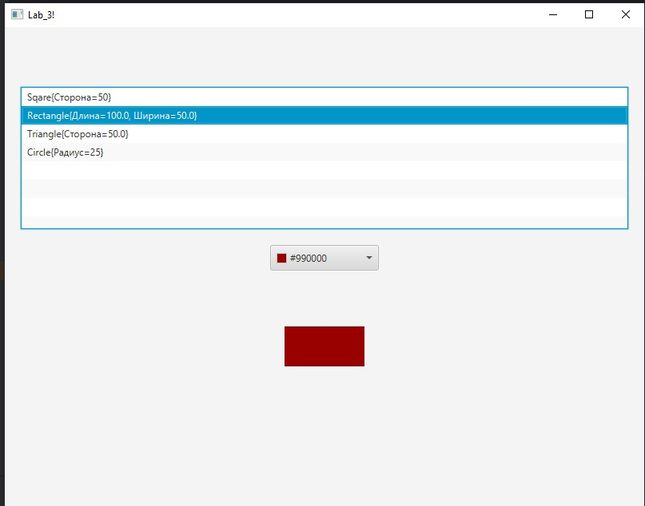
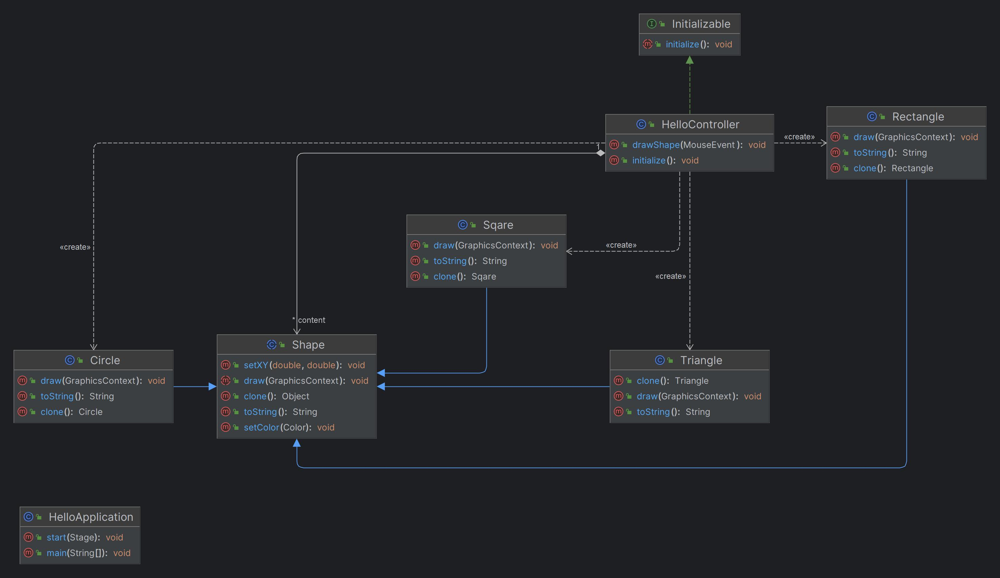

# java_lab_2
**Описание:** В данном репозитории представлена программа для рисования фигур.
Для использования данного приложения вам необходимо:
* **Технологический стек**: Java. Данное ПО предназначено как автономное;
* **Статус**: v2.0.1;

**Скриншот рабочего окна приложения:**

## Архитектура
**Скриншот диаграммы классов:**

## Зависимости
Язык программироваия **Java**, комплект разработчика приложений **JDK 17**, а также инструментарий GUI **JavaFX**.
## Конфигурация
Для данного ПО не требуется специальная настройка
## Применение
Для использования данной программы вам необходимо:
* Выбрать фигуру, которую хотите нарисовать;
* Выбрать цвет фигуры;
* Выбрать цвет обводки;
* Нажать ЛКМ на поле для рисования;
* По необходимости нажать на кнопку *Стоп*;
## Проблемы
Некрасивый интерфейс
## Получение справочной информации
Для получения любой справочной информации пишите главному разработчику [в телеграмм](https://t.me/Anion11)
## Приглашение к сотрудничеству
Для развития данного проекта требуется хороший и интуитивно понятный дизайн интерфейса, а также предложения для расширения возможностей приложения.
 
